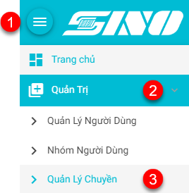
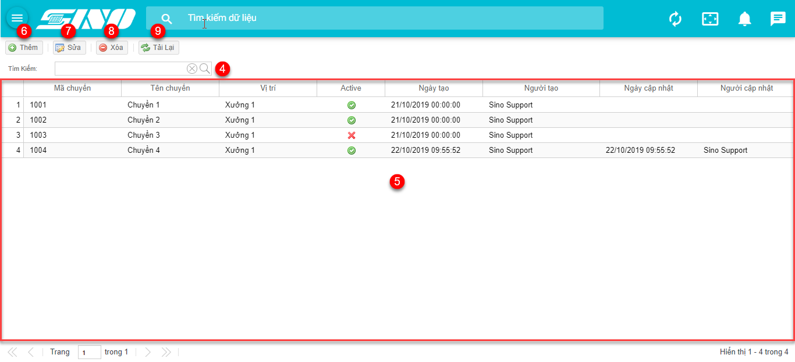
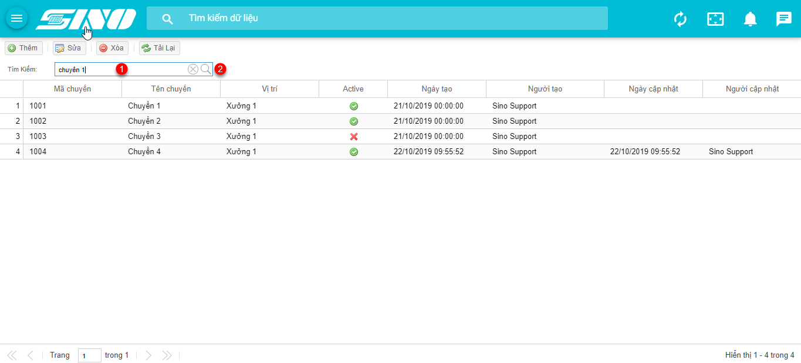
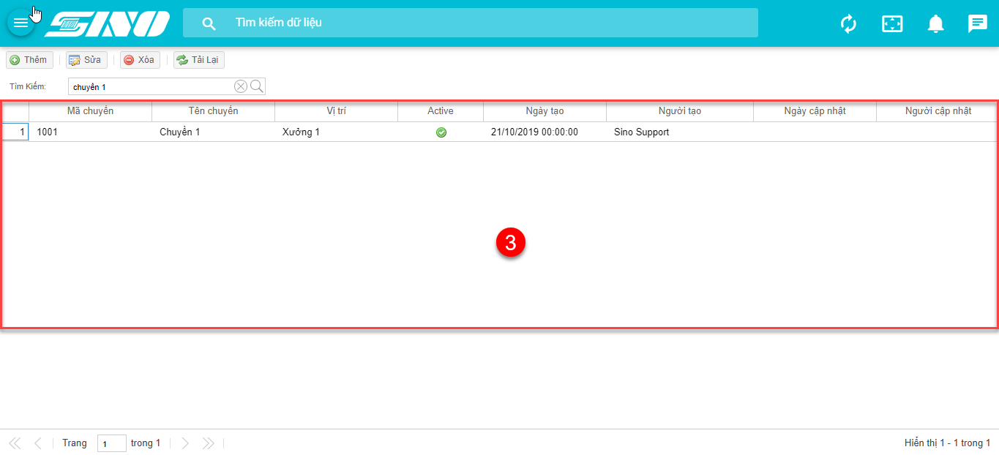
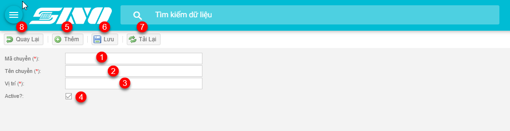
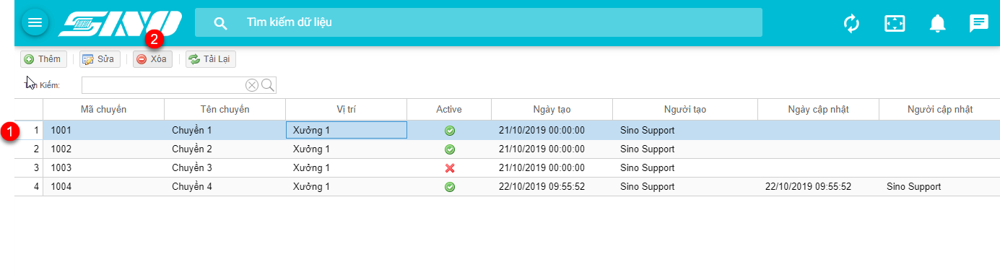
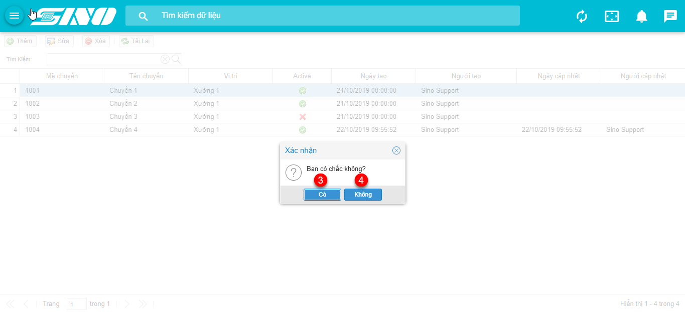

### **1. Màn hình quản lý chuyền**
* Đăng nhập với quyền Quản trị, và thực hiện các bước sau:

     

     * (1): Hiển thị chức năng
     * (2): Tab Quản Trị
     * (3): Quản lý chuyền

* Màn hình hiển thị như sau:

     

     * (4): Vùng Tìm kiếm dữ liệu
     * (5): Vùng Danh sách các chuyền
     * (6): Nút Thêm – thực hiện thêm mới chuyền
     * (7): Nút Sửa – thực hiện sửa thông tin chuyền
     * (8): Nút Xóa – thực hiện xóa chuyền
     * (9): Nút Tải lại – thực hiện tải lại trang

### **2. Chức năng tìm kiếm**
* Thực hiện tìm kiếm dữ liệu tại vùng Tìm kiếm như hình sau:

     

     * (1): Tìm kiếm bằng cách nhập tên chuyền, mã chuyền
     * (2): Nút Tìm kiếm – thực hiện chức năng tìm kiếm các thông tin được nhập vào và trả về kết quả như hình sau:

     

     * (3): Danh sách kết quả trả về sau khi tìm kiếm

### **3. Chức năng tạo mới chuyền**
* Nhấn Nút (6) Thêm tại phần 1, hiển thị màn hình Thêm mới chuyền như hình sau:

     

     * (1): Nhập mã chuyền
     * (2): Nhập tên chuyền
     * (3): Nhập vị trí
     * (4): Chuyền được Active không?

* Nút chức năng
	* (5): Nút Thêm – thực hiện thêm mới chuyền
     * (6): Nút Lưu – thực hiện lưu dữ liệu vừa nhập
     * (7): Nút Quay lại – Quay lại trang danh sách chuyền
     * (8): Nút Tải lại – Tải lại trang

### **4. Chức năng sửa thông tin chuyền**
* Nhấn Nút Sửa (7) tại phần 1, hiển thị màn hình Sửa thông tin chuyền như hình sau:

     

     * (1): Nhập tên chuyền
     * (2): Nhập vị trí
     * (3): Chuyền được Active không?

* Nút chức năng
	* (4): Nút Thêm – thực hiện thêm mới chuyền
     * (5): Nút Lưu – thực hiện lưu dữ liệu vừa nhập
     * (6): Nút Quay lại – Quay lại trang danh sách chuyền
     * (7): Nút Tải lại – Tải lại trang

### **5. Chức năng xóa thông tin chuyền**
* Tại màn hình Quản lý chuyền tại vùng Danh sách chuyền thực hiện xóa 1 chuyền như hình sau:

     

     * (1): Chọn chuyền muốn xóa khỏi hệ thống
     * (2): Nút Xóa – thực hiện xóa chuyền

* Sau khi nhấn vào Nút (2) Xóa thì hiển thị màn hình:

     

     * (3): Nút Có – thực hiện xóa thành công
     * (4): Nút Không – không thực hiện xóa