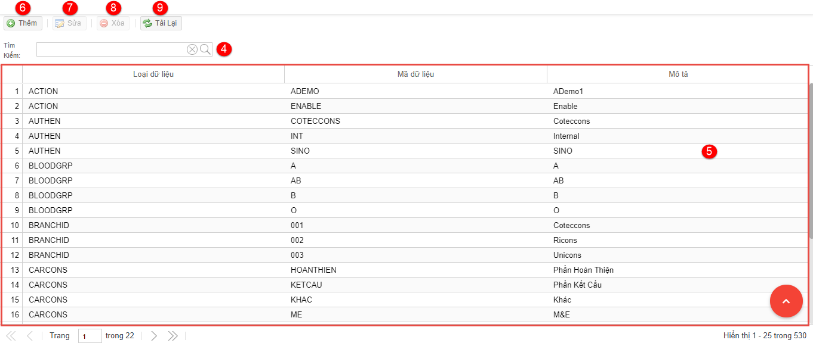
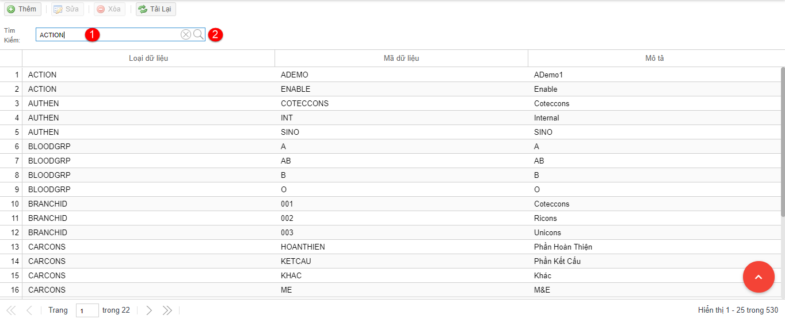
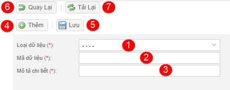

### **1. Màn hình quản lý dữ liệu nền**
* Đăng nhập với quyền Quản trị, và thực hiện các bước sau:

     

     * (1): Hiển thị chức năng
     * (2): Tab Quản Trị
     * (3): Quản lý dữ liệu nền

* Màn hình hiển thị như sau:

     

     * (4): Vùng Tìm kiếm dữ liệu
     * (5): Vùng Danh sách các dữ liệu
     * (6): Nút Thêm – thực hiện thêm mới dữ liệu
     * (7): Nút Sửa – thực hiện sửa thông tin dữ liệu (không được phép thực hiện)
     * (8): Nút Xóa – thực hiện xóa dữ liệu (không được phép thực hiện)
     * (9): Nút Tải lại – thực hiện tải lại trang

### **2. Chức năng tìm kiếm**
* Thực hiện tìm kiếm dữ liệu tại vùng Tìm kiếm như hình sau:

     

     * (1): Tìm kiếm bằng cách nhập loại dữ liệu, tên dữ liệu
     * (2): Nút Tìm kiếm – thực hiện chức năng tìm kiếm các thông tin được nhập vào và trả về kết quả như hình sau:

     

     * (3): Danh sách kết quả trả về sau khi tìm kiếm

### **3. Chức năng tạo mới dữ liệu nền**
* Nhấn Nút (6) Thêm tại phần 1, hiển thị màn hình Thêm mới dữ liệu nền như hình sau:

     

     * (1): Chọn loại dữ liệu
     * (2): Nhập mã dữ liệu
     * (3): Nhập mô tả
* Nút chức năng
     * (4): Nút Thêm – thực hiện thêm mới dữ liệu nền
     * (5): Nút Lưu – thực hiện lưu dữ liệu vừa nhập
     * (6): Nút Quay lại – Quay lại trang danh sách dữ liệu nền
     * (7): Nút Tải lại – Tải lại trang