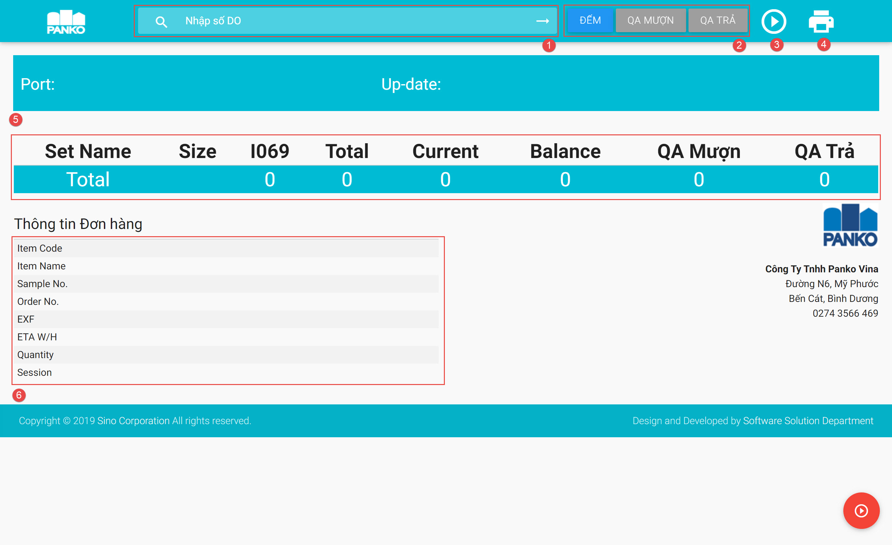
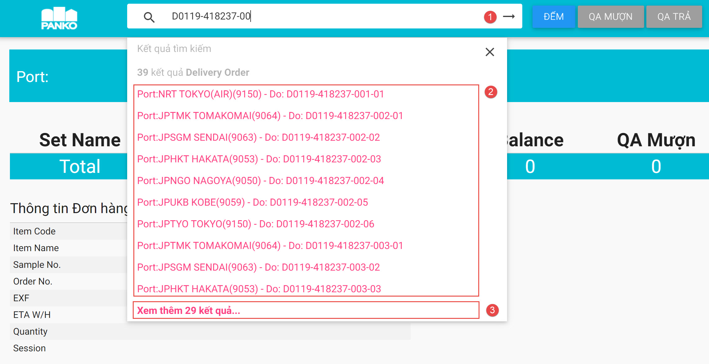
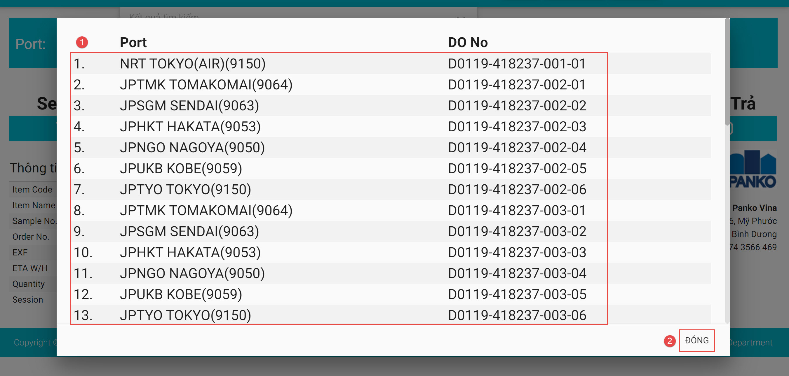
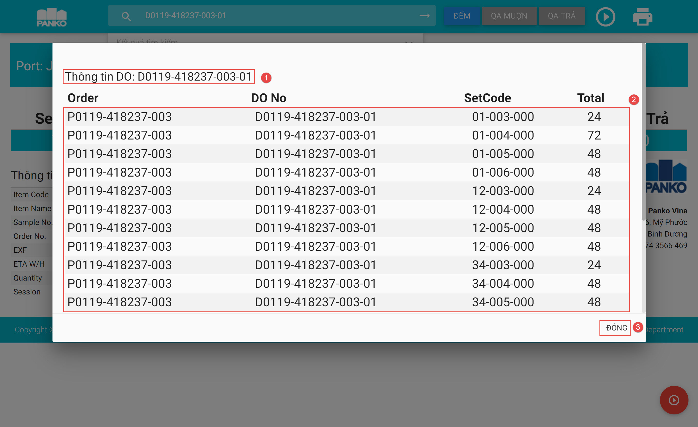
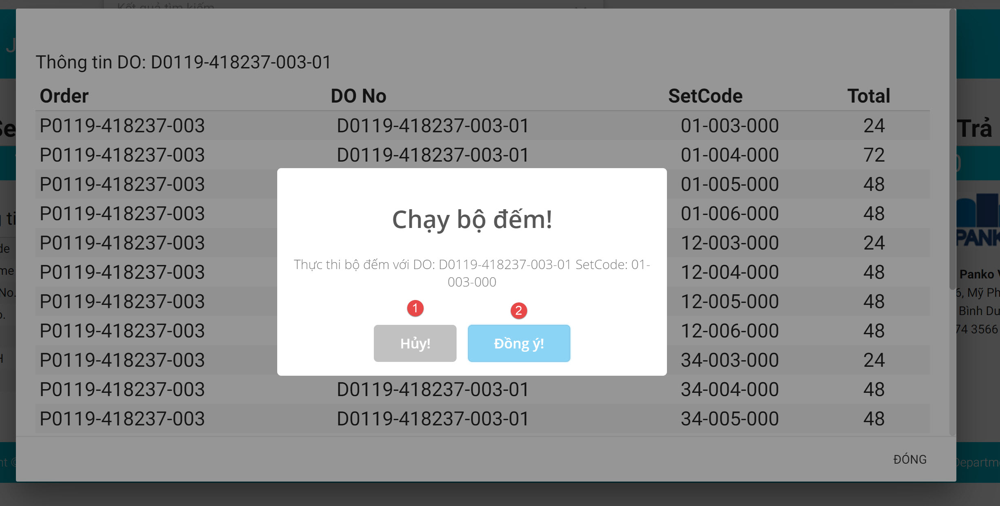

### **1. Thực hiện bật ứng dụng kiểm đếm**
* Thực hiện nhấn đúp chuột vào biểu tượng PANKO để hởi động ứng dụng:

     

* Màn hình hiển thị như sau:

     

     * (1): Vùng Tìm kiếm dữ liệu và nhập dữ liệu đơn hàng
     * (2): Vùng chọn chức năng kiểm đếm (bao gồm: Đếm, QA Mượn, QA Trả)
     * (3): Nút Bật/Ngừng – thực chạy chuyền / ngừng chuyền với chức năng ở (2) đã chọn
     * (4): Nút In – thực hiện In thông tin đơn hàng đã chọn (cấu hình máy in khổ giấy theo tùy chọn của Hệ điều hành đã cài của PC)
     * (5): Vùng thông tin kiểm đếm, tự động mở rộng/thu hẹp theo thông tin nhập
     * (6): Nút Tải lại – thực hiện tải lại trang

### **2. Chức năng tìm kiếm DO**
* Thực hiện tìm kiếm dữ liệu tại vùng Tìm kiếm như hình sau:

     

     * (1): Tìm kiếm bằng cách nhập mã DO 
     * (2): Kết quả danh sách 10 DO trả về gần đúng nhất, bấm chọn DO cần thực hiện thao tác chọn SetCode
     * (3): Kết quả toàn bộ danh sách DO trả về như hình sau:

     

     * (1): Danh sách toàn bộ kết quả trả về sau khi tìm kiếm,bấm chọn DO cần thực hiện thao tác SetCode
     * (2): Dóng danh sách kết quả nếu không tìm thấy hoặc không muốn thực hiện thao tác đếm

### **3. Chức năng tìm kiếm SetCode của DO**
*  Sau khi bấm chọn DO cần thực hiện thao tác đếm tại phần 2, hiển thị màn hình Danh sách SetCode như hình sau:

     

     * (1): Mã DO
     * (2): Danh sách SetCode của DO hiện tại, bấm chọn SetCode để bắt thực hiện 
     * (3): Nút đóng để không thực hiện thao tác đếm
 
 *  Sau khi bấm chọn SetCode cần thực hiện thao tác đếm, hiển thị màn hình xác nhận như hình sau:
     

     * (1): Nút Hủy thao tác
     * (2): Nút Đồng ý thực hiện thao tác đếm

### **4. Chức năng Đếm thông tin**
* Sau khi xác nhận DO và SetCode thực hiện thao tác, hiển thị màn hình đếm trên chuyền như hình sau:

     

     * (1): Danh sách số lượng sản phẩm với SKU tương ứng
     * (2): Số lượng thực tế trên chuyền
     * (3): Các lỗi xảy ra trong quá trình thực hiện
     * (4): Các cảnh báo trong quá trình thực hiện
     * (5): Dừng quá trình thực hiện

### **5. Chức năng Mượn QA**
* Thực hiện nhấn chọn chức năng Mượn QA theo hình sau:

     

* Sau khi xác nhận DO và SetCode thực hiện thao tác, hiển thị màn hình đếm trên chuyền như hình sau:

     

     * (1): Danh sách số lượng sản phẩm với SKU tương ứng
     * (2): Số lượng thực tế trên chuyền
     * (3): Các lỗi xảy ra trong quá trình thực hiện
     * (4): Các cảnh báo trong quá trình thực hiện
     * (5): Dừng quá trình thực hiện

### **6. Chức năng Trả QA**
* Thực hiện nhấn chọn chức năng Trả QA theo hình sau:

     

* Sau khi xác nhận DO và SetCode thực hiện thao tác, hiển thị màn hình đếm trên chuyền như hình sau:

     

     * (1): Danh sách số lượng sản phẩm với SKU tương ứng
     * (2): Số lượng thực tế trên chuyền
     * (3): Các lỗi xảy ra trong quá trình thực hiện
     * (4): Các cảnh báo trong quá trình thực hiện
     * (5): Dừng quá trình thực hiện

### **7. Danh sách quét lỗi trong phiên làm việc **

* Bấm chọn hiện danh sách lỗi trong phiên làm việc (chỉ hiện thị phiên hiện tại, mất khi thực hiện tải lại trang):

     

     * (1): Danh sách Quét lỗi
     * (2): Danh sách DO và SetCode đã thực hiện

### **7. Chức năng in thông tin **

* Bấm chọn nút In (biểu tượng máy in) như hình sau:

     

* Màn hình thể hiện thông tin đơn hàng đã chọn (cấu hình máy in khổ giấy theo tùy chọn của Hệ điều hành đã cài của PC):

     
     * (1): Bản in xem thử
     * (2): Cấu hình và thông số máy in